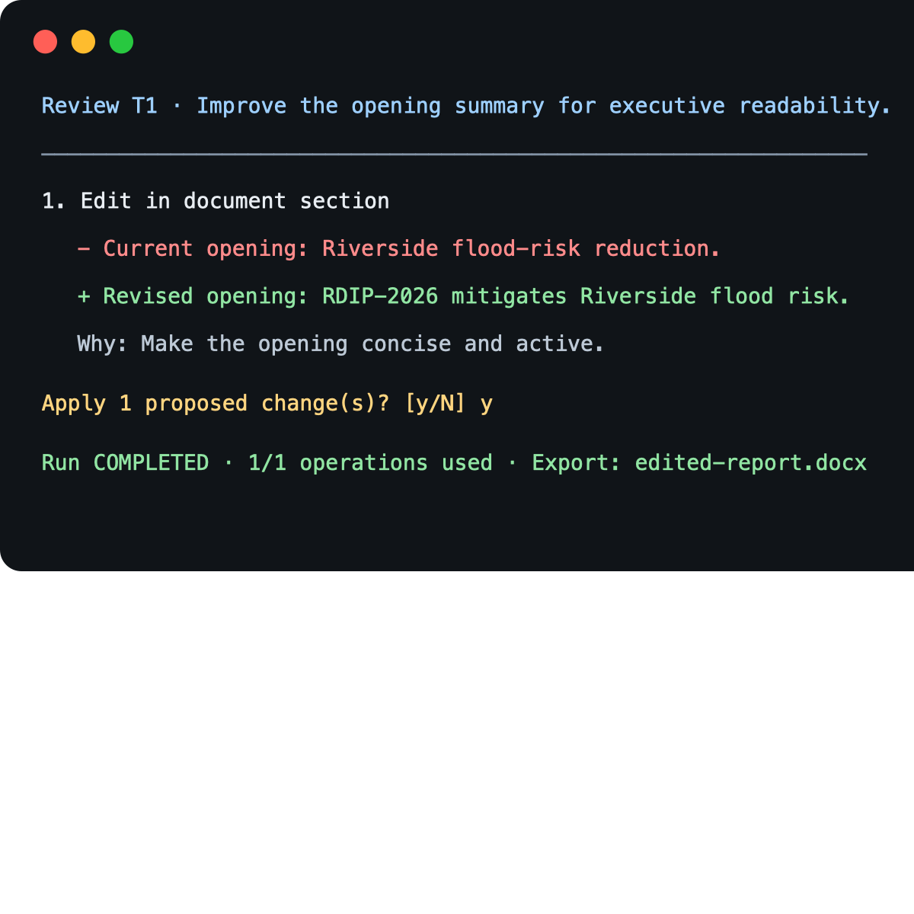

# Bounded Run Agent

## What it does

Edits a DOCX through SuperDocs under a fixed operation budget and optional deadline. A task is only complete after SuperDocs finishes the approved job; the final report distinguishes completed, failed, and unattempted tasks.



## Why this exists

Document agents should not quietly run past a user’s limit or claim work was completed when it was not. This CLI makes the budget, review decision, and final outcome visible.

## SuperDocs features used

- Durable DOCX upload
- Asynchronous chat editing with compact responses
- Job polling
- `ask_every_time` human approval
- DOCX export

## Architecture

`DOCX + request → finite task plan → budget/deadline check → SuperDocs edit → terminal review → approve/reject → verified job → export`

## Setup

```bash
cd use-cases/apooravmalik/bounded-run-agent
cp .env.example .env
# Edit .env and set SUPERDOCS_API_KEY
```

## Run

Interactive mode asks for the DOCX, request, and operation limit:

```bash
python3 main.py
```

Flag-driven mode supports repeatable `.docx`, `.md`, and `.txt` references:

```bash
python3 main.py \
  --file /path/to/project-report.docx \
  --resource /path/to/policy.md \
  --resource /path/to/source-notes.docx \
  --request "Rewrite the executive summary; clarify project risks" \
  --max-operations 2 \
  --deadline-seconds 120 \
  --output output/edited-report.docx
```

## Example bounded run

Given four tasks and `--max-operations 2`, the first two may complete, while `T3` and `T4` are reported as `NOT_ATTEMPTED` with `OPERATION_BUDGET_EXHAUSTED`. The agent never starts a third edit.

## Human review flow

Before an edit is applied, the CLI renders SuperDocs’ proposed before/after text and explanation:

```text
Review T1 · Rewrite the executive summary
1. Edit in document section
   − Existing wording
   + Proposed wording
   Why: Concise explanation
Apply 1 proposed change(s)? [y/N]
```

`--auto-approve-demo` exists only for automated demos; it bypasses the prompt.

## Honest report

The final terminal summary shows operation use, completed tasks, rejected/failed tasks, stop reason, and export location. Export failure is reported separately from completed edits.

## MCP status

The assigned card specifies MCP. SuperDocs publishes an MCP server with equivalent tools—`upload_document_base64`/`process_uploaded_document`, `chat_async`, `get_job`, `approve_change`, and `export_document`—at `https://api.superdocs.app/mcp/`.

This standalone Python CLI is live-verified against the equivalent REST upload/chat/approve/export workflow. MCP integration is not included because this CLI has no configured Streamable-HTTP MCP client or MCP host for the interactive terminal review; replacing the verified REST transport would add a separate client runtime without changing the user workflow. The working REST transport is intentionally preserved.

## Tests

```bash
python3 -m unittest discover -s tests -v
python3 main.py --help
```

## Demo

A live DOCX edit was run with SuperDocs: proposed changes were shown in the terminal, manually approved, verified as completed, and exported.

## Known limitations

- The deadline is checked before each operation; it does not cancel a job that has already started.
- Task splitting uses semicolons/newlines.
- Reference files are capped to keep edit instructions bounded.

## Credit

Built by Apoorav Malik for the SuperDocs engineering task.
