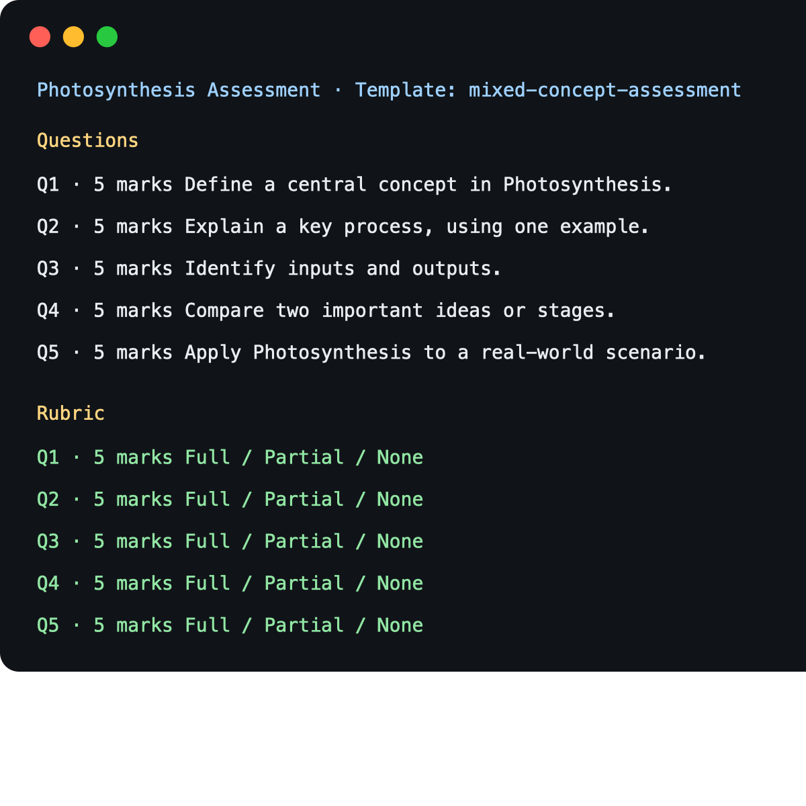

# Rubric + Assessment Builder

## What it does

Builds an assessment and matching rubric from a topic and JSON template. It validates every question/rubric relationship before SuperDocs is called, then creates and exports one combined DOCX.



## Why this exists

Generating questions and rubrics separately risks missing rows, duplicate IDs, and mismatched marks. This builder makes those relationships explicit and rejects invalid packages before document creation.

## SuperDocs features used

- Asynchronous document creation from exact HTML
- Terminal job verification
- DOCX export

## Template format

Templates are real runtime inputs. They select the question blueprint and required rubric levels:

```json
{
  "name": "mixed-concept-assessment",
  "question_blueprint": ["definition", "process", "inputs_outputs", "comparison", "application"],
  "rubric_levels": ["full_credit", "partial_credit", "no_credit"]
}
```

Examples: [`examples/mixed.json`](examples/mixed.json) and [`examples/short-answer.json`](examples/short-answer.json). A template cannot request more questions than it defines; the CLI fails clearly instead of silently inventing a shape.

## Setup

```bash
cd use-cases/apooravmalik/rubric-assessment-builder
cp .env.example .env
# Edit .env and set SUPERDOCS_API_KEY
```

## Preview-only

This validates and prints the package without making a SuperDocs request:

```bash
python3 main.py \
  --topic Photosynthesis \
  --grade 8 \
  --questions 5 \
  --total-marks 25 \
  --template examples/mixed.json \
  --preview-only
```

## Create and export

```bash
python3 main.py \
  --topic Photosynthesis \
  --grade 8 \
  --questions 5 \
  --total-marks 25 \
  --template examples/mixed.json \
  --output output/photosynthesis-assessment.docx
```

The CLI shows all questions and rubric rows before asking for confirmation. Run `python3 main.py` to supply values interactively. `--auto-approve-demo` is only for non-interactive demos.

## Alignment guarantees

Before creation, the builder enforces:

- `N` questions = `N` rubric rows
- Question IDs exactly match rubric IDs
- Question marks exactly match rubric marks
- No duplicate/missing/extra IDs
- Requested total marks match the question total

## Tests

```bash
python3 -m unittest discover -s tests -v
python3 main.py --help
```

## Demo

The mixed template was live-verified with five Photosynthesis questions and 25 marks: SuperDocs created the document and exported the DOCX.

## Known limitations

- Question and rubric wording are deterministic drafts; educators should review subject-matter quality.
- The three required rubric levels are intentionally fixed to keep validation strict.

## Credit

Built by Apoorav Malik for the SuperDocs engineering task.
